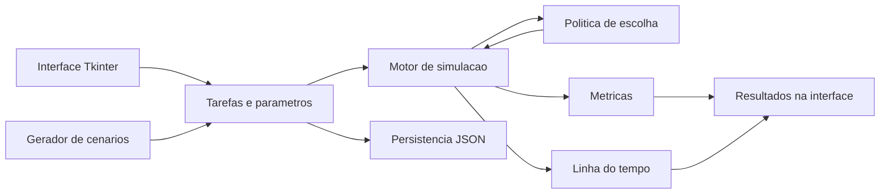

# Documentacao Tecnica do Projeto

## Visao geral

O Simulador de Escalonamento de Tarefas modela a execucao de tarefas em um processador unico, com tempo discreto e avanco em unidades inteiras. O programa implementa FCFS, SJF, SRTF, Round-Robin, prioridade cooperativa e prioridade preemptiva. O simulador tambem representa um recurso exclusivo R, bloqueio direto, inversao de prioridades, heranca de prioridade, teto de prioridade e envelhecimento.

## Arquitetura

O projeto separa mecanismo e politica. O mecanismo esta em `simulador/motor.py` e controla relogio, tarefas prontas, tarefas suspensas, troca de contexto, recurso R, atualizacao de estado e metricas. A politica e a regra que escolhe a proxima tarefa pronta.



## Modulos

| Modulo | Funcao |
|---|---|
| `main.py` | Ponto de entrada do programa. |
| `simulador/modelos.py` | Define tarefas de entrada, intervalos, metricas e resultado da simulacao. |
| `simulador/motor.py` | Executa o laco de simulacao e aplica as convencoes C1-C10. |
| `simulador/cenarios.py` | Gera cenarios, salva/carrega JSON e fornece os cenarios oficiais. |
| `simulador/gui.py` | Implementa a interface grafica em Tkinter. |
| `control/` e `view/` | Mantem wrappers de compatibilidade com a estrutura original. |
| `tests/test_motor.py` | Valida os cenarios oficiais e as regras de entrada. |

## Interfaces principais

| Item | Entrada | Saida | Funcao |
|---|---|---|---|
| `simular(tarefas, algoritmo, quantum, ttc, protocolo_prioridade, envelhecimento, alpha)` | Lista de `TarefaEntrada` e parametros do escalonador. | `ResultadoSimulacao`. | Valida entradas, executa o motor e devolve metricas, medias e linha do tempo. |
| `TarefaEntrada` | `id`, `ingresso`, `tp`, `prioridade`, `recurso_inicio`, `recurso_duracao`. | Objeto imutavel da tarefa. | Representa a entrada usada pelo motor, pela GUI e pelos cenarios JSON. |
| `ResultadoSimulacao` | Dados produzidos pelo motor. | Objeto com metricas, medias, intervalos e auxiliares. | Centraliza o resultado consumido pela interface e pelos testes. |
| `gerar_tarefas()` | Quantidade e limites de ingresso, duracao e prioridade. | Lista de tarefas sorteadas. | Cria cenarios aleatorios para simulacao unica ou lote. |
| `salvar_cenario()` e `carregar_cenario()` | Caminho de arquivo JSON e lista de tarefas. | Arquivo gravado ou lista carregada. | Permitem preservar e reexaminar cenarios. |
| `comparar_lote()` | Quantidade de cenarios, quantidade de tarefas e parametros de sorteio. | Linhas com medias por algoritmo. | Executa os seis algoritmos sobre varios cenarios sorteados. |
| `AplicacaoSimulador` | Eventos da janela Tkinter. | Atualizacao de tabelas, metricas e diagrama. | Implementa a interacao com usuario sem exigir argumentos de linha de comando. |

## Estrutura de uma tarefa

| Campo | Tipo | Funcao |
|---|---|---|
| `id` | inteiro | Identificador unico da tarefa. |
| `ingresso` | inteiro | Instante em que a tarefa entra no sistema. |
| `tp` | inteiro | Tempo de processamento requerido. |
| `prioridade` | inteiro | Prioridade base; valor maior significa prioridade maior. |
| `recurso_inicio` | inteiro ou nulo | Tempo de execucao propria apos o qual a tarefa solicita R. |
| `recurso_duracao` | inteiro | Quantas unidades de execucao propria a tarefa mantem R. |

## Parametros configuraveis

| Parametro | Faixa valida | Uso |
|---|---|---|
| `algoritmo` | FCFS, SJF, SRTF, RR, PRIOc, PRIOp | Define a politica de escolha. |
| `quantum` | inteiro positivo | Usado no Round-Robin. |
| `ttc` | inteiro maior ou igual a zero | Custo de troca de contexto, aplicado a todos os algoritmos. |
| `protocolo_prioridade` | `nenhum`, `heranca`, `teto` | Define o tratamento da prioridade quando ha recurso R. |
| `envelhecimento` | habilitado/desabilitado | Aumenta a prioridade efetiva de tarefas prontas. |
| `alpha` | inteiro maior ou igual a zero | Incremento de prioridade por unidade de espera. |

No Round-Robin, `quantum` deve ser maior que `ttc`. A eficiencia so e definida para Round-Robin e e calculada por `E = tq / (tq + ttc)`.

## Politicas

| Algoritmo | Regra de escolha |
|---|---|
| FCFS | Menor instante de ingresso; empate por menor identificador. |
| SJF | Menor `tp`; empate por menor ingresso e menor identificador. |
| SRTF | Menor tempo restante; empate por menor ingresso e menor identificador. |
| RR | Primeiro elemento da fila circular. |
| PRIOc | Maior prioridade efetiva, sem preempcao. |
| PRIOp | Maior prioridade efetiva, com preempcao por unidade de tempo. |

## Laco de simulacao

A cada decisao, o motor monta o conjunto de tarefas prontas com tarefas que ja ingressaram, ainda nao concluiram e nao estao suspensas aguardando R. A politica recebe esse conjunto e devolve uma tarefa. Quando a tarefa escolhida e diferente da ultima que ocupou o processador, uma troca de contexto e registrada, inclusive no primeiro despacho.

Nos algoritmos preemptivos, a escolha e reavaliada a cada unidade de tempo util. Nos algoritmos cooperativos, a tarefa escolhida executa ate concluir ou ate ficar suspensa ao solicitar um recurso ocupado. No Round-Robin, a tarefa executa ate concluir, bloquear ou esgotar a fatia util.

## Recurso exclusivo R

A secao critica usa o tempo de execucao propria da tarefa. Se `recurso_inicio = 1` e `recurso_duracao = 4`, a tarefa obtem R apos executar 1 unidade util e libera o recurso quando alcanca 5 unidades executadas. Se outra tarefa solicita R enquanto o recurso esta ocupado, ela fica suspensa, sai do conjunto de prontas e so retorna quando R e liberado.

## Heranca de prioridade

Com heranca habilitada, a prioridade efetiva da tarefa que detem R e o maior valor entre sua prioridade base e as prioridades das tarefas suspensas aguardando R. A elevacao e temporaria e termina quando o recurso e liberado. A prioridade base armazenada na entrada da tarefa nao e alterada.

## Teto de prioridade

Com teto habilitado, o teto de R e a maior prioridade entre as tarefas que declaram secao critica. Assim que uma tarefa obtem R, sua prioridade efetiva passa a ser no minimo esse teto. O teto e preventivo e pode alterar a ordem mesmo quando a disputa futura nao ocorre. Heranca e teto sao alternativos.

## Envelhecimento

Quando o envelhecimento esta habilitado, uma tarefa pronta recebe `alpha` unidades de prioridade efetiva por unidade de tempo desde seu ultimo despacho ou desde seu ingresso, se ainda nao executou. Ao receber o processador, a contagem volta ao valor base.

## Convencoes C1-C10

| Convencao | Implementacao |
|---|---|
| C1 | O tempo e discreto e avanca em unidades inteiras. |
| C2 | Valor maior significa prioridade mais alta. |
| C3 | Empates usam menor ingresso e depois menor identificador. |
| C4 | Toda mudanca de tarefa gera troca de contexto, inclusive o primeiro despacho. |
| C5 | No RR, o custo de troca e descontado da fatia: trabalho util = `tq - ttc` quando ha troca. |
| C6 | Tarefa que esgota quantum volta a cauda depois das tarefas que ingressaram naquele instante. |
| C7 | Secao critica e medida pelo tempo de execucao propria. |
| C8 | `tw = tt - tp`, incluindo fila, suspensao e troca de contexto. |
| C9 | Teto usa todas as tarefas que declaram R; heranca e teto nao se combinam. |
| C10 | Envelhecimento conta desde o ultimo despacho ou desde o ingresso. |

Quando nenhuma tarefa ingressou, o relogio salta para o proximo instante de ingresso e registra CPU ociosa.

## Metricas

Para cada tarefa, o simulador apresenta conclusao, `tt`, `tp`, `tw` e tempo ate a primeira execucao. As medias sao calculadas sobre todas as tarefas.

| Metrica | Formula |
|---|---|
| `tt` | `t_conclusao - t_ingresso` |
| `tp` | valor informado na entrada |
| `tw` | `tt - tp` |
| primeira execucao | `t_primeira_execucao - t_ingresso` |

## Salvamento e carregamento

Os cenarios sao salvos em JSON com versao e lista de tarefas. O arquivo preserva identificador, ingresso, `tp`, prioridade e configuracao de secao critica.

## Gerador de cenarios

O gerador cria tarefas com ingresso, duracao e prioridade sorteados dentro dos limites definidos pela interface. A comparacao em lote sorteia varios cenarios e executa os seis algoritmos para apresentar medias de `tt`, `tw` e tempo ate a primeira execucao.

## Dependencias e ambiente

O programa em execucao usa apenas a biblioteca padrao do Python, especialmente `tkinter`, `json`, `random`, `pathlib` e `unittest`. A versao usada nos testes locais e Python 3.12.6. O executavel Windows e gerado com PyInstaller por meio de `Simulador.spec`.

## Geracao do executavel

O build de desenvolvedor usa:

```powershell
python -m pip install -r requirements-dev.txt
pyinstaller Simulador.spec --clean --noconfirm
```

O arquivo final esperado para duplo clique e `dist/Simulador.exe`.
