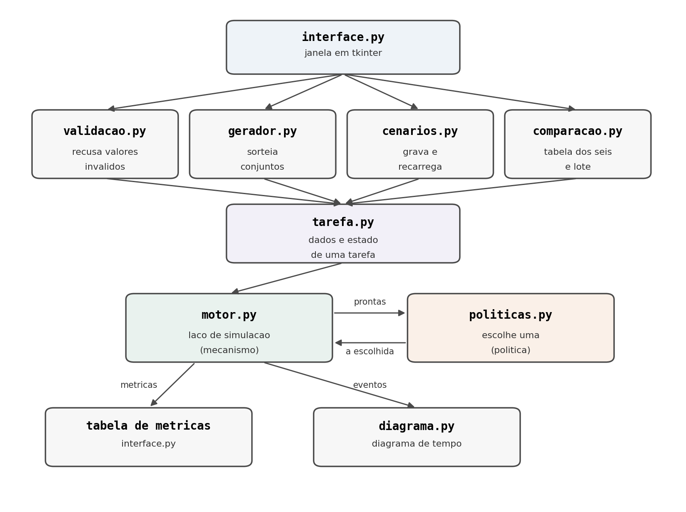

# Documentação Técnica

## Simulador de Escalonamento de Tarefas

Disciplina de Sistemas Operacionais

Este documento descreve o funcionamento interno do simulador. É a referência
para quem precisa entender, modificar ou estender o programa. A operação do
simulador pelo usuário está nos tutoriais, em `docs/`.

---

## 1. Visão geral

O simulador reproduz o escalonamento de um conjunto de tarefas em um
processador único, com tempo discreto. O modelo é o adotado em sala: o relógio
avança de uma em uma unidade, e em cada instante exatamente uma tarefa ocupa o
processador, ou nenhuma.

Cada tarefa é descrita por um instante de ingresso, um tempo de processamento
demandado e uma prioridade. Opcionalmente, uma tarefa declara uma seção
crítica: o trecho da sua execução em que detém, com exclusão mútua, um recurso
R.

O programa implementa seis algoritmos de escalonamento (FCFS, SJF, SRTF,
Round-Robin, prioridade cooperativa e prioridade preemptiva), dois protocolos
de correção da inversão de prioridades (herança e teto) e o envelhecimento
como tratamento da inanição. Ao final de cada simulação, apresenta por tarefa
e em média o tempo de execução, o tempo de processamento, o tempo de espera e
o tempo até a primeira execução, acompanhados do diagrama de tempo.

O programa não modela múltiplos processadores, múltiplos recursos, operações
de entrada e saída nem tarefas periódicas. Existe um único recurso R.

---

## 2. Separação entre política e mecanismo

Esta separação é o eixo da arquitetura do simulador.

O **mecanismo** é o laço de simulação, em `motor.py`. Ele é único e idêntico
para os seis algoritmos. Suas responsabilidades:

- avançar o relógio de uma em uma unidade;
- saltar o relógio quando nenhuma tarefa está pronta;
- montar o conjunto de tarefas prontas;
- detectar e cobrar a troca de contexto;
- conceder e liberar o recurso R, suspendendo quem o solicita ocupado;
- recalcular a prioridade efetiva sob herança, teto e envelhecimento;
- registrar as métricas e os eventos que alimentam o diagrama de tempo.

A **política** é a decisão de qual tarefa recebe o processador. Está em
`politicas.py`. Cada política é uma função que recebe o conjunto de tarefas
prontas e devolve uma delas. Nada mais.

O motor não conhece o critério de escolha: ele recebe a política como
parâmetro e a consulta. A política não conhece o relógio, o estado do
processador nem os parâmetros de tempo: tudo de que precisa está nos campos da
própria tarefa. A consequência prática é que cada algoritmo ocupa uma linha de
código.

### Onde a fronteira fica

Três decisões delimitam a fronteira, e valem registro porque não são óbvias.

**A política decide quem, o motor decide por quanto tempo.** O quantum é
propriedade da configuração do escalonador, não do conjunto de tarefas, e
contar tempo é trabalho do relógio. Por isso o quantum é parâmetro do motor, e
não responsabilidade da política do Round-Robin.

**A preempção não está na política, está na frequência da consulta.** SJF e
SRTF usam o mesmo critério de escolha — o menor tempo de processamento — e
compartilhariam a mesma função se o critério fosse a única diferença. A
distinção é que o motor consulta a política apenas quando o processador está
livre, sob um algoritmo cooperativo, e a cada unidade de tempo, sob um
preemptivo. O mesmo vale para o par PRIOc e PRIOp, que de fato compartilham a
função `prio`.

**A elevação de prioridade não está na política.** Herança, teto e
envelhecimento alteram a prioridade efetiva de uma tarefa, e essa alteração é
feita pelo motor antes de consultar a política. A política lê
`prio_efetiva()` e não sabe se o valor devolvido é a prioridade base, uma
prioridade herdada ou uma prioridade elevada pelo envelhecimento.

O Round-Robin é a única política que não cabe nesse formato, porque depende de
uma ordem que o conjunto de prontas não guarda. O motor mantém uma fila
explícita para ele e, quando o quantum está definido, despacha o primeiro da
fila sem consultar política alguma.

---

<div class="page"/>

## 3. Diagrama de módulos



As setas indicam o fluxo de dados. A entrada das tarefas parte da interface,
seja digitada campo por campo, sorteada pelo gerador ou lida de um cenário
gravado. Os valores digitados passam pela validação e, em qualquer dos três
caminhos, são convertidos em objetos `Tarefa`.

O motor executa a simulação consultando a política a cada decisão de despacho:
entrega o conjunto de tarefas prontas e recebe de volta a escolhida. Desse
diálogo saem dois produtos. As métricas ficam acumuladas nos próprios objetos
`Tarefa` e a interface as apresenta em tabela. A lista de eventos, um registro
por unidade de tempo, é convertida pelo módulo de diagrama na representação
visual da execução.

O sentido das setas entre `motor.py` e `politicas.py` é o que expressa a
separação descrita na seção anterior: o motor pergunta, a política responde, e
nenhum dos dois acessa o estado interno do outro.

---

## 4. Estrutura de uma tarefa

Definida em `tarefa.py`. Os quatro primeiros campos são dados de entrada; o
quinto é opcional; os demais são estado acumulado durante a simulação.

| Campo | Tipo | Função |
|---|---|---|
| `id` | inteiro | Identificador da tarefa. Usado também como último critério de desempate. |
| `ingresso` | inteiro | Instante em que a tarefa surge. Não negativo. |
| `tp` | inteiro | Tempo de processamento demandado. Positivo. |
| `prioridade` | inteiro | Prioridade base. Valor maior significa prioridade mais alta. |
| `secao_critica` | tupla ou `None` | Par `(inicio, duracao)` indicando quando a tarefa obtém R e por quanto tempo o mantém, medido no tempo de execução própria. `None` se a tarefa não usa o recurso. |
| `executado` | inteiro | Unidades úteis já executadas. Começa em zero. |
| `conclusao` | inteiro ou `None` | Instante em que a tarefa concluiu. |
| `primeira_exec` | inteiro ou `None` | Tempo decorrido entre o ingresso e o primeiro despacho. |
| `suspensa` | booleano | Verdadeiro enquanto a tarefa espera o recurso ocupado. Tarefa suspensa sai do conjunto de prontas. |
| `elevacao` | inteiro ou `None` | Prioridade atribuída por herança ou teto, enquanto a tarefa detém R. `None` quando não há elevação. |
| `bonus` | inteiro | Acréscimo de prioridade produzido pelo envelhecimento. |
| `ultimo_despacho` | inteiro ou `None` | Instante do último despacho. Referência do envelhecimento. |

### Métodos

| Método | Devolve | O que faz |
|---|---|---|
| `restante()` | inteiro | `tp - executado`. Critério do SRTF. |
| `terminou()` | booleano | Verdadeiro quando `executado >= tp`. |
| `precisa_de_r()` | booleano | Verdadeiro quando `executado` está no intervalo da seção crítica. |
| `prio_efetiva()` | inteiro | A prioridade que o escalonador usa: a base, substituída pela elevação quando esta é maior, somada ao bônus do envelhecimento. |
| `tt()` | inteiro | `conclusao - ingresso`. Tempo de execução. |
| `tw()` | inteiro | `tt() - tp`. Tempo de espera. |

A separação entre `prioridade` e `elevacao` é deliberada. Registrar a elevação
em um campo próprio, em vez de sobrescrever a prioridade base, é o que permite
revertê-la ao liberar o recurso. Uma herança que não é desfeita transformaria
a tarefa de menor prioridade na de maior prioridade do sistema pelo resto da
execução.

---

## 5. Interface dos módulos

### `tarefa.py`

Contém apenas a classe `Tarefa`, descrita na seção anterior.

### `politicas.py`

Cada função recebe a lista de tarefas prontas e devolve a escolhida. Todas
desempatam por menor instante de ingresso e, em seguida, menor identificador.

| Função | Critério |
|---|---|
| `fcfs(prontas)` | menor `ingresso` |
| `sjf(prontas)` | menor `tp` |
| `srtf(prontas)` | menor `restante()` |
| `prio(prontas)` | maior `prio_efetiva()` |

Não há função para o Round-Robin: a sua escolha é o primeiro da fila mantida
pelo motor. E não há funções distintas para SJF e SRTF, nem para PRIOc e
PRIOp, porque os pares compartilham o critério e diferem apenas na
preemptividade, que é parâmetro do motor.

### `motor.py`

| Função | Recebe | Devolve | O que faz |
|---|---|---|---|
| `teto_de_r(tarefas)` | lista de `Tarefa` | inteiro ou `None` | Calcula o teto do recurso: a maior prioridade entre as tarefas que declaram seção crítica. `None` se nenhuma declara. |
| `simular(tarefas, politica, preemptivo, ttc, tq, protocolo, alfa)` | o conjunto de tarefas e os parâmetros | dicionário com `trocas`, `linha_do_tempo`, `eventos` e `fim` | Executa a simulação completa. Altera os objetos `Tarefa` recebidos, preenchendo `conclusao`, `primeira_exec` e `executado`. |
| `eficiencia(tq, ttc)` | os dois parâmetros de tempo | fração ou `None` | Devolve `tq / (tq + ttc)`, ou `None` quando não há quantum definido. |

O dicionário devolvido por `simular` contém:

- `trocas`: número total de trocas de contexto;
- `linha_do_tempo`: lista de pares `(instante, id da tarefa)`, um por unidade
  de tempo em que houve execução;
- `eventos`: lista de dicionários, um por unidade de tempo, com as chaves
  `t`, `executando`, `com_r`, `suspensas` e `troca`. É a entrada do módulo de
  diagrama;
- `fim`: instante em que a simulação terminou.

### `gerador.py`

| Função | Recebe | Devolve | O que faz |
|---|---|---|---|
| `sortear_dados(n, ingresso_max, tp_max, prio_max, com_recurso)` | quantidade e faixas | lista de tuplas | Sorteia `n` conjuntos de dados de tarefa, respeitando as faixas válidas. |
| `montar(dados)` | lista de tuplas | lista de `Tarefa` | Constrói objetos `Tarefa` a partir dos dados. |

A separação entre sortear dados e montar objetos é necessária para a
comparação em lote. Um objeto `Tarefa` carrega estado mutável, de modo que
executar dois algoritmos sobre os mesmos objetos faria o segundo receber
tarefas já concluídas pelo primeiro. Guardando os dados como tuplas imutáveis
e reconstruindo objetos novos para cada algoritmo, os seis partem do mesmo
conjunto de tarefas e do mesmo estado inicial.

### `comparacao.py`

Contém o dicionário `ALGORITMOS`, que associa cada sigla à sua política, à sua
preemptividade e ao uso de quantum. É esse dicionário que a interface percorre
para montar a seleção de algoritmos, o que garante que a interface e o motor
não possam divergir sobre a configuração de cada algoritmo.

| Função | Recebe | Devolve | O que faz |
|---|---|---|---|
| `rodar(dados, nome, tq, ttc, protocolo, alfa)` | dados e a sigla do algoritmo | dicionário com `Tt`, `Tw` e `primeira` | Executa um algoritmo sobre um conjunto de dados e devolve as médias. |
| `comparar_lote(n_cenarios, n_tarefas, tq, ttc)` | tamanho do lote e dos cenários | dicionário de médias por algoritmo | Sorteia `n_cenarios` conjuntos e executa os seis algoritmos sobre cada um, acumulando as médias. |

### `diagrama.py`

| Função | Recebe | Devolve | O que faz |
|---|---|---|---|
| `diagrama_de_tempo(tarefas, eventos)` | as tarefas e a lista de eventos | texto | Monta o diagrama de tempo: uma linha por tarefa, o tempo no eixo horizontal, mais uma linha marcando as trocas de contexto e a legenda. |

Os símbolos do diagrama:

| Símbolo | Significado |
|---|---|
| `#` | a tarefa está executando |
| `=` | a tarefa está executando e detém o recurso R |
| `.` | a tarefa está suspensa, esperando o recurso |
| `-` | a tarefa está pronta, esperando na fila |
| espaço | a tarefa ainda não ingressou, ou já concluiu |
| `x` | na linha inferior: unidade de tempo consumida por troca de contexto |

### `cenarios.py`

| Função | Recebe | Devolve | O que faz |
|---|---|---|---|
| `pasta_de_cenarios()` | — | caminho | Devolve o caminho da pasta `cenarios/`, criando-a se necessário. |
| `gravar(caminho, dados, tq, ttc, alfa)` | caminho, dados e parâmetros | — | Grava o conjunto de tarefas e os parâmetros em JSON. |
| `carregar(caminho)` | caminho | par `(dados, parametros)` | Lê um conjunto de tarefas gravado. |

A pasta de cenários é resolvida em relação à raiz do projeto, e não em relação
ao módulo. Quando o programa executa empacotado, o código é descomprimido em
um diretório temporário, de modo que um caminho relativo ao módulo apontaria
para um local que desaparece ao fechar o programa. A função `_raiz_do_projeto`
verifica o atributo `sys.frozen` para distinguir os dois casos e usa o
diretório do executável quando empacotado.

### `validacao.py`

| Função | Recebe | Devolve | O que faz |
|---|---|---|---|
| `inteiro(texto, nome, minimo)` | texto digitado, nome do campo e mínimo | inteiro | Converte e valida. Levanta `EntradaInvalida` com mensagem específica quando o texto está vazio, não é um inteiro ou é menor que o mínimo. |
| `validar_secao_critica(inicio, duracao, tp)` | os três valores | tupla | Verifica que a seção crítica cabe na duração da tarefa. |
| `validar_quantum(tq, ttc)` | os dois parâmetros | inteiro | Verifica que o quantum é maior que o custo da troca. |
| `ler_tarefa(id, ...)` | os textos dos campos | tupla de dados | Valida todos os campos de uma tarefa e devolve os dados, ou levanta `EntradaInvalida`. |

Toda recusa é sinalizada pela exceção `EntradaInvalida`, cuja mensagem é
exibida na interface em uma caixa de diálogo. A validação é um módulo separado
da interface para que possa ser verificada sem abrir a janela.

### `interface.py`

Contém a classe `Janela`, que monta os cinco blocos da tela e trata os eventos
dos botões, e a função `criar_janela`, que inicia a aplicação.

O tratamento de cada ação é envolvido em captura de exceção. `EntradaInvalida`
produz uma mensagem específica; qualquer outra exceção produz uma mensagem
genérica. Em ambos os casos a janela permanece aberta, conforme exigido pelo
requisito de entrega.

### `main.py`

Ponto de entrada. Chama `criar_janela`.

---

## 6. Parâmetros configuráveis

Todos são informados pela interface, durante a execução. Nenhum está fixado no
código-fonte.

| Parâmetro | Faixa válida | Padrão | Efeito |
|---|---|---|---|
| Quantum `tq` | inteiro maior ou igual a 1, e maior que `ttc` | 2 | Tamanho da fatia sob Round-Robin. Ignorado pelos outros cinco algoritmos. |
| Custo da troca `ttc` | inteiro maior ou igual a 0 | 0 | Tempo consumido por troca de contexto. Vale para todos os algoritmos. Zero reduz o modelo ao das tabelas da Aula 5. |
| Passo do envelhecimento `alfa` | inteiro maior ou igual a 0 | 0 | Unidades de prioridade ganhas por unidade de tempo de espera. Zero desativa o envelhecimento. |
| Protocolo de correção | `nenhum`, `heranca` ou `teto` | `nenhum` | Mecanismo de correção da inversão de prioridades. Herança e teto são alternativos e não se combinam. |
| Quantidade de tarefas | inteiro maior ou igual a 1 | 5 | Número de tarefas a sortear. |
| Cenários sorteados | inteiro maior ou igual a 1 | 50 | Tamanho do lote na comparação entre algoritmos. |

A combinação de quantum menor ou igual ao custo da troca é recusada com
mensagem. Se a troca consumisse a fatia inteira, nenhum trabalho útil seria
realizado.

A eficiência `E = tq / (tq + ttc)` é propriedade da configuração do
escalonador, não do conjunto de tarefas: dois cenários diferentes sob o mesmo
quantum e o mesmo custo têm a mesma eficiência. Nos cinco algoritmos sem
quantum ela não está definida, e o programa indica isso em vez de exibir um
valor.

### Faixas do sorteio

| Grandeza | Faixa |
|---|---|
| Ingresso | 0 a 8 |
| Tempo de processamento | 1 a 6 |
| Prioridade | 1 a 5 |
| Seção crítica | início entre 0 e `tp - 1`, duração de 1 até o que resta de `tp` |

### Faixas da entrada digitada

| Campo | Faixa |
|---|---|
| Ingresso | maior ou igual a 0 |
| Duração | maior ou igual a 1 |
| Prioridade | maior ou igual a 1 |
| Seção crítica | início mais duração menor ou igual a `tp` |

---

## 7. Funcionamento interno

Esta seção descreve o que ocorre a cada unidade de tempo do laço de simulação,
na ordem em que ocorre.

O laço executa enquanto existir tarefa não concluída. Cada iteração
corresponde a uma unidade de tempo de execução, ou a uma decisão que não
consome tempo.

### 7.1 Enfileiramento

As tarefas que já ingressaram e ainda não entraram na fila são acrescentadas a
ela, ordenadas por instante de ingresso e, em caso de empate, por
identificador. A fila é usada apenas pelo Round-Robin, mas é mantida em todos
os algoritmos para simplificar o laço.

Uma lista auxiliar registra quais tarefas já foram enfileiradas alguma vez,
evitando que a mesma tarefa entre na fila repetidamente a cada iteração.

### 7.2 Recálculo do bônus de envelhecimento

Quando o passo `alfa` é diferente de zero, o bônus de cada tarefa é
recalculado como `alfa` multiplicado pelo tempo decorrido desde o seu último
despacho, ou desde o seu ingresso caso ela ainda não tenha executado.

Uma tarefa que acabou de executar tem o último despacho igual ao instante
atual, de modo que o seu bônus é zero. É assim que a prioridade volta ao valor
base quando a tarefa recebe o processador.

### 7.3 Recálculo da herança de prioridade

Quando o protocolo de herança está habilitado e existe um detentor do recurso,
a elevação do detentor é recalculada como a maior prioridade entre a sua
própria e as das tarefas suspensas. O recálculo ocorre a cada unidade de tempo
porque o conjunto de suspensas muda.

### 7.4 Montagem do conjunto de prontas e consulta à política

Sob os cinco algoritmos sem quantum, o conjunto de prontas é formado pelas
tarefas que já ingressaram, ainda não concluíram e não estão suspensas.

Se o conjunto está vazio, nenhuma tarefa ingressou ainda e o relógio salta
para o próximo instante de ingresso, sem consumir tempo de execução. O caso
passa despercebido enquanto o relógio está em zero e só se manifesta quando
existe um intervalo ocioso no meio da simulação.

A política é consultada em três situações: nenhuma tarefa está em execução, a
tarefa em execução concluiu, ou o algoritmo é preemptivo. Sob um algoritmo
cooperativo, a tarefa escolhida permanece no processador até concluir; sob um
preemptivo, a escolha é refeita a cada unidade de tempo.

Sob Round-Robin, não há consulta à política. Quando o processador está livre,
a primeira tarefa da fila é despachada e a fatia é dimensionada: `tq` unidades
se a tarefa despachada é a mesma que ocupava o processador, ou `tq - ttc`
unidades quando houve troca.

Se a fila está vazia, o relógio salta para o próximo ingresso, como no caso
anterior.

### 7.5 Concessão ou suspensão no recurso

Se a tarefa escolhida precisa do recurso e não é ela que o detém, há dois
desfechos.

Se o recurso está livre, a tarefa passa a detê-lo. Sob o protocolo de teto, a
sua elevação é fixada no valor do teto neste momento — na obtenção do recurso,
e não quando um conflito surge.

Se o recurso está ocupado, a tarefa é marcada como suspensa e o laço reinicia
sem consumir tempo. Na iteração seguinte ela não constará do conjunto de
prontas e não poderá ser escolhida, por mais alta que seja a sua prioridade. É
esse o mecanismo que produz a inversão de prioridades.

Uma invariante sustenta o laço nesse ponto: uma tarefa só se suspende se
existir um detentor, e o detentor não está suspenso nem concluiu, de modo que
o conjunto de prontas nunca fica vazio enquanto houver alguma tarefa suspensa.

### 7.6 Troca de contexto

Há troca de contexto sempre que a tarefa despachada é diferente da última que
ocupou o processador. Como a referência à última tarefa começa vazia, o
primeiro despacho da simulação também conta como troca.

Havendo troca, o contador é incrementado e o relógio avança `ttc` unidades sem
que nenhuma tarefa progrida. Cada uma dessas unidades é registrada como um
evento sem tarefa em execução, o que produz as marcações da linha de trocas no
diagrama de tempo.

### 7.7 Execução de uma unidade

Se este é o primeiro despacho da tarefa, o tempo até a primeira execução é
registrado como a diferença entre o instante atual e o seu ingresso. O
registro ocorre após o pagamento da troca de contexto, de modo que a métrica
inclui esse custo.

O instante e a tarefa são acrescentados à linha do tempo, e um evento é
registrado com a tarefa em execução, o detentor do recurso e a lista de
suspensas. O contador de unidades executadas da tarefa é incrementado, o
relógio avança uma unidade, o último despacho da tarefa é atualizado e a fatia
é decrementada.

### 7.8 Liberação do recurso

Se a tarefa que acabou de executar detém o recurso e já não precisa dele, o
recurso é liberado. A elevação da tarefa é desfeita, restaurando a sua
prioridade base, e todas as tarefas suspensas voltam a ser prontas.

A reversão é imediata e vale para os dois protocolos.

### 7.9 Conclusão ou fim de fatia

Se a tarefa concluiu, o instante de conclusão é registrado e o processador
fica livre.

Se a tarefa não concluiu e a fatia esgotou, sob Round-Robin, as tarefas que
ingressaram neste instante são enfileiradas **antes** de a tarefa preemptada
voltar à cauda. A ordem dessas duas operações determina a posição de retorno
na fila e altera os números produzidos.

---

## 8. Convenções de simulação

As convenções abaixo são as decisões de modelagem que determinam os valores
produzidos. Sem elas, o mesmo conjunto de tarefas gera resultados diferentes.
São as convenções adotadas em sala, e é a adesão a elas que permite reproduzir
os cenários de validação do enunciado.

### C1. Unidade de tempo

O tempo é discreto e avança de uma em uma unidade. Nos cenários de referência
a unidade é o segundo. Todos os parâmetros e todas as grandezas de tempo são
inteiros.

### C2. Sentido da escala de prioridades

Valor maior significa prioridade mais alta. A política de prioridade seleciona
o maior valor de prioridade efetiva.

### C3. Critério de desempate

Entre tarefas equivalentes segundo o critério do algoritmo, vence a de menor
instante de ingresso; persistindo o empate, a de menor identificador.

O desempate não é um detalhe secundário. Sob envelhecimento, por exemplo, é
comum a prioridade efetiva de uma tarefa antiga cruzar exatamente o valor de
uma tarefa recém-ingressada, e é o desempate que define qual das duas é
despachada.

### C4. Quando ocorre troca de contexto

Ocorre troca de contexto sempre que a tarefa despachada é diferente da última
que ocupou o processador, inclusive no primeiro despacho da simulação.

Uma tarefa que retoma o processador sem que nenhuma outra tenha executado no
intervalo não gera troca.

### C5. Como o custo da troca é cobrado

O custo da troca é descontado da fatia concedida, nunca somado a ela. Sob
Round-Robin, a tarefa executa `tq - ttc` unidades úteis quando houve troca.

Com quantum 4 e custo 1, cada fatia de quatro unidades de relógio entrega três
unidades de trabalho útil. A convenção alternativa — conceder a fatia cheia e
acrescentar o custo — produziria um tempo total maior e não reproduziria os
valores de referência.

### C6. Posição de retorno na fila

A tarefa que esgota o quantum volta à cauda da fila depois das que ingressaram
naquele mesmo instante.

No código, isso corresponde a enfileirar os novos ingressos antes de
reinserir a tarefa preemptada. Invertendo as duas operações, a tarefa
preemptada seria atendida antes dos ingressos daquele instante e o
Round-Robin produziria outros números.

### C7. Referência de tempo da seção crítica

A seção crítica é medida no tempo de execução própria da tarefa, e não no
relógio. Início 1 e duração 4 significa que a tarefa obtém o recurso após
executar 1 unidade útil e o mantém até ter executado 5.

A consequência é que a preempção de uma tarefa no meio da sua seção crítica
não altera o momento em que ela libera o recurso em termos de trabalho
próprio: ela o manterá até completar a quinta unidade executada, por mais
tempo de relógio que isso demore.

### C8. Composição do tempo de espera

`tw = tt - tp`. O tempo de espera engloba o tempo na fila de prontas, o tempo
suspensa à espera do recurso e o tempo consumido por trocas de contexto.

Não há, portanto, distinção entre esperar na fila e esperar bloqueada: as duas
situações entram na mesma métrica. É o diagrama de tempo que permite
distingui-las, com os símbolos `-` e `.`.

### C9. Cálculo do teto e exclusividade entre protocolos

O teto de um recurso é calculado sobre as tarefas que **declaram** seção
crítica nele, ainda que a disputa não chegue a ocorrer. O cálculo é feito uma
única vez, no início da simulação.

Herança e teto são protocolos alternativos e não se combinam. A interface
apresenta os dois como opções mutuamente exclusivas, ao lado da opção de não
usar nenhum.

### C10. Referência de tempo do envelhecimento

O envelhecimento conta o tempo decorrido desde o último despacho da tarefa,
ou desde o seu ingresso caso ela ainda não tenha executado. A prioridade
efetiva volta ao valor base assim que a tarefa recebe o processador.

### C11. Relógio ocioso

Se nenhuma tarefa está pronta, o relógio salta diretamente para o próximo
instante de ingresso, em vez de avançar de uma em uma unidade. O salto não
consome tempo de execução e não gera evento no diagrama.

### C12. Momento da elevação de prioridade

Sob herança, a elevação ocorre quando existem tarefas suspensas à espera do
recurso: o protocolo é reativo, e age depois que a disputa aparece.

Sob teto, a elevação ocorre no instante em que o recurso é obtido,
independentemente de haver ou não disputa: o protocolo é preventivo.

A diferença de implementação é a condição que dispara a elevação. A diferença
de comportamento não é pequena: sob herança o bloqueio da tarefa prioritária é
encurtado, e sob teto ele pode ser evitado por completo. O custo do teto
aparece quando a disputa nunca chega a ocorrer, caso em que a elevação atrasa
tarefas intermediárias sem benefício algum.

### Simplificação conhecida

Quando o custo da troca é maior que zero e o algoritmo é preemptivo, uma
tarefa que ingressa durante o pagamento da troca só é considerada na unidade
de tempo seguinte. A alternativa seria reavaliar a escolha após o pagamento,
o que permitiria oscilação entre duas tarefas sem progresso.

Nenhum dos cenários de validação do enunciado recai nesse caso: os dois
cenários com custo de troca não nulo usam FCFS e Round-Robin, ambos
não preemptivos no sentido relevante aqui.

---

## 9. Dependências e ambiente

### Bibliotecas

O projeto não utiliza nenhuma biblioteca externa. Todos os módulos importados
pertencem à biblioteca padrão do Python:

| Módulo | Onde é usado | Para que |
|---|---|---|
| `tkinter` | `interface.py` | A janela, os controles e as caixas de diálogo. |
| `json` | `cenarios.py` | Gravação e leitura dos cenários. |
| `os` | `cenarios.py` | Composição de caminhos e criação da pasta de cenários. |
| `sys` | `cenarios.py` | Detecção do modo empacotado. |
| `random` | `gerador.py` | Sorteio dos conjuntos de tarefas. |

A ausência de dependências externas é deliberada. Cada biblioteca externa é
uma possibilidade adicional de o programa não abrir na máquina de quem o
executa.

### Versão do Python

Desenvolvido e testado em Python 3.14. Compatível com 3.10 ou superior. Nenhum
recurso específico de versão recente é utilizado.

No Windows, `tkinter` acompanha a instalação padrão do interpretador. Em
distribuições Linux pode ser necessário instalar o pacote correspondente.

### Geração do executável

O executável foi gerado com PyInstaller, a partir da pasta `codigo-fonte`:

```
python -m PyInstaller --onefile --windowed --name Simulador main.py
```

A opção `--onefile` produz um único arquivo, e `--windowed` suprime a janela
de console. O arquivo resultante é copiado de `dist/` para a raiz do
repositório, onde recebe o duplo clique. As pastas de trabalho do PyInstaller
e o arquivo de especificação não são versionados.

### Verificação

Os arquivos de teste em `codigo-fonte/` conferem o simulador contra os
cenários de validação do enunciado. São executados com `python <arquivo>` de
dentro da pasta, e imprimem `OK` ou `ERRO` para cada valor conferido. Os
valores esperados estão reunidos em `testes/cenarios_referencia.json`.