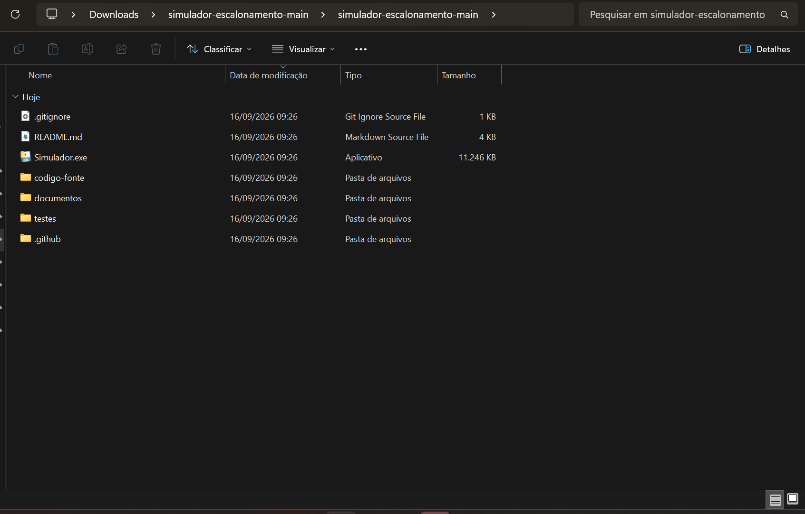
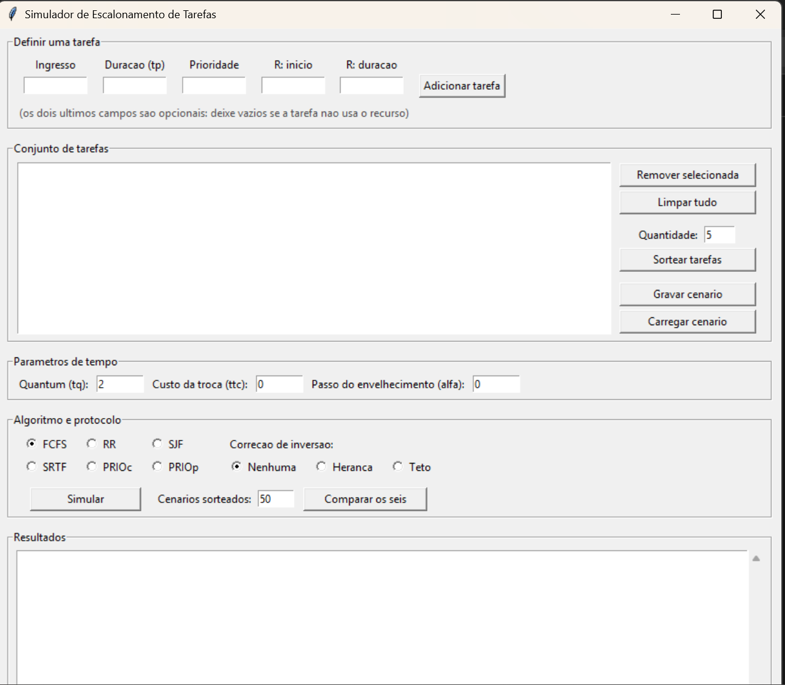
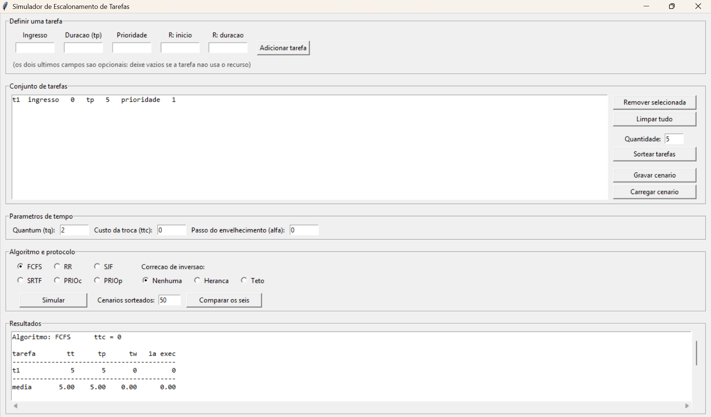

# Tutorial de Execução

## Simulador de Escalonamento de Tarefas

Disciplina de Sistemas Operacionais

Este tutorial mostra como colocar o programa para funcionar. Siga os passos na
ordem. Ao final, o simulador estará aberto e produzindo um resultado na tela.

Para aprender a operar cada função do programa, consulte o
[tutorial de uso](./tutorial_uso.pdf).

---

## 1. Pré-requisitos

- Windows 10 ou 11.

Nada mais. O programa entregue é um executável independente: **não é necessário
instalar Python, montar ambiente virtual nem digitar comando algum.**

---

## 2. Abertura

Descompacte o arquivo da entrega em uma pasta qualquer.

Se você baixou o projeto pelo botão **Code → Download ZIP** do GitHub, note que
o arquivo compactado cria uma pasta dentro de outra com o mesmo nome. O
conteúdo do projeto está na pasta **interna**.

Na pasta do projeto, localize o arquivo **`Simulador.exe`**, identificado como
"Aplicativo" na coluna Tipo.



Dê **dois cliques** em `Simulador.exe`.

A primeira abertura leva alguns segundos. Isso é normal: o executável
descomprime o programa antes de iniciar.

---

## 3. Primeira tela

A janela abre vazia, com cinco blocos empilhados de cima para baixo.



| Bloco | Para que serve |
|---|---|
| **Definir uma tarefa** | Os campos de uma tarefa e o botão que a acrescenta ao conjunto. |
| **Conjunto de tarefas** | A lista das tarefas já definidas, e os botões de remover, limpar, sortear, gravar e carregar. |
| **Parâmetros de tempo** | O quantum, o custo da troca de contexto e o passo do envelhecimento. |
| **Algoritmo e protocolo** | A escolha entre os seis algoritmos, a correção de inversão de prioridades, e os botões que executam a simulação. |
| **Resultados** | A tabela de métricas e o diagrama de tempo. |

Os campos do primeiro bloco:

| Campo | O que informar |
|---|---|
| **Ingresso** | O instante em que a tarefa surge. |
| **Duração (tp)** | O tempo de processamento que a tarefa demanda. |
| **Prioridade** | A prioridade da tarefa. Valor maior significa prioridade mais alta. |
| **R: início** | Opcional. Depois de quantas unidades de trabalho a tarefa obtém o recurso. |
| **R: duração** | Opcional. Por quantas unidades a tarefa mantém o recurso. |

Deixe os dois últimos campos vazios se a tarefa não usa o recurso.

---

## 4. Execução mínima

Esta é a sequência mais curta que produz um resultado na tela. Serve para
confirmar que o programa funciona.

1. No bloco **Definir uma tarefa**, preencha:
   - **Ingresso**: `0`
   - **Duração (tp)**: `5`
   - **Prioridade**: `1`
   - Deixe **R: início** e **R: duração** vazios;
2. Clique em **Adicionar tarefa**. A tarefa aparece na lista como
   `t1  ingresso 0  tp 5  prioridade 1`;
3. No bloco **Algoritmo e protocolo**, confirme que **FCFS** está selecionado e
   que a correção de inversão está em **Nenhuma**;
4. Clique em **Simular**.

---

## 5. Resultado esperado

O bloco **Resultados** passa a exibir a tabela de métricas e o diagrama de
tempo.



Confira os valores. Com uma única tarefa de duração 5 ingressando no instante
zero, o resultado é:

| Métrica | Valor |
|---|---|
| tt (tempo de execução) | 5 |
| tp (tempo de processamento) | 5 |
| tw (tempo de espera) | 0 |
| Tempo até a primeira execução | 0 |
| Trocas de contexto | 1 |
| Eficiência | não definida |

O tempo de espera é zero porque não há outra tarefa disputando o processador. A
eficiência não está definida porque o FCFS não usa quantum.

Se esses valores apareceram na tela, o programa está funcionando corretamente
nesta máquina.

---

## 6. Problemas conhecidos

### O Windows exibe um aviso de aplicativo não reconhecido

Clique em **Mais informações** e depois em **Executar assim mesmo**.

O executável não é assinado digitalmente, e esse aviso é o comportamento padrão
do Windows para programas sem assinatura. Não indica problema com o arquivo.

### Nada acontece após o duplo clique

Aguarde alguns segundos. A primeira abertura descomprime o programa antes de
exibir a janela.

### Não encontro o arquivo `Simulador.exe`

Se o Windows está configurado para ocultar extensões, o arquivo aparece apenas
como **Simulador**, com ícone de aplicativo. Identifique-o pela coluna Tipo, que
mostra "Aplicativo".

Para exibir as extensões, no Explorador de Arquivos acesse
**Exibir → Mostrar → Extensões de nome de arquivo**.

### A janela abre e fecha sozinha

O programa não encerra por conta própria, nem ao concluir uma simulação nem
diante de um erro. Valores inválidos produzem uma caixa de mensagem e a janela
permanece aberta.

Se ainda assim a janela fechar, execute o programa a partir do código-fonte
para ler a mensagem de erro:

```
cd codigo-fonte
python main.py
```

### Quero executar a partir do código-fonte

É necessário Python 3.10 ou superior, com `tkinter` — que acompanha a
instalação padrão no Windows. O projeto não usa nenhuma biblioteca externa.

```
cd codigo-fonte
python main.py
```
