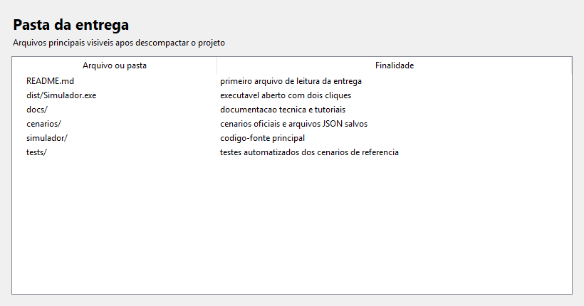
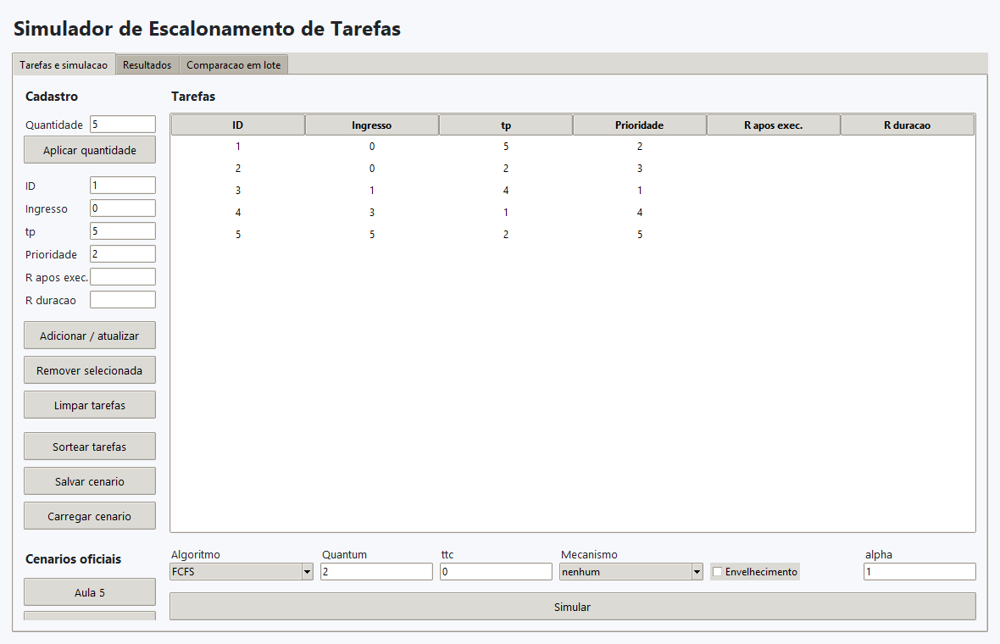

# Tutorial de Execucao

## Pre-requisitos

Use Windows. Para a entrega final com executavel, nao e necessario instalar Python, criar ambiente virtual nem instalar bibliotecas.

Para executar pelo codigo-fonte durante desenvolvimento, use Python 3.12.6 ou versao compativel com Tkinter.

## Estrutura da pasta descompactada

Ao descompactar a entrega final, a pasta deve conter o executavel e os arquivos do projeto.

## Abertura

Clique duas vezes em `dist/Simulador.exe`.

Se o executavel for copiado para a raiz da entrega, clique duas vezes em `Simulador.exe`.

## Primeira tela

A janela inicial mostra a aba `Tarefas e simulacao`. A tabela de tarefas ja inicia com o cenario da Aula 5 carregado para facilitar a primeira validacao.

## Execucao minima

1. Mantenha o cenario da Aula 5 carregado.
2. Em `Algoritmo`, selecione `FCFS`.
3. Em `Quantum`, mantenha `2`.
4. Em `ttc`, informe `0`.
5. Em `Mecanismo`, mantenha `nenhum`.
6. Deixe `Envelhecimento` desmarcado.
7. Clique em `Simular`.

## Resultado esperado

A aba `Resultados` deve mostrar:

| Metrica | Valor esperado |
|---|---:|
| Media `tt` | 8,00 |
| Media `tp` | 2,80 |
| Media `tw` | 5,20 |
| Media ate 1a execucao | 5,20 |
| Trocas de contexto | 5 |

O diagrama temporal deve mostrar a sequencia:

`t1[0,5) t2[5,7) t3[7,11) t4[11,12) t5[12,14)`

## Problemas comuns

| Problema | Acao |
|---|---|
| A janela nao abre | Confirme se o arquivo aberto e `Simulador.exe`, nao um arquivo de build intermediario. |
| O Windows mostra alerta de arquivo desconhecido | Clique em `Mais informacoes` e depois em `Executar assim mesmo`, se a origem do arquivo for a entrega do grupo. |
| O programa mostra erro de valor invalido | Corrija o campo indicado na mensagem e clique em `Simular` novamente. |
| Round-Robin recusa a configuracao | Garanta que `quantum` seja maior que `ttc`. |
| O executavel fecha ao abrir | Execute novamente a partir da pasta descompactada e registre a mensagem de erro para conferencia do grupo. |

## Conferencia rapida

Depois da primeira execucao, teste tambem:

1. Selecione `RR`, mantenha `Quantum = 2` e `ttc = 0`, clique em `Simular` e confira media `tt = 8,40` e media `tw = 5,60`.
2. Selecione `FCFS`, informe `ttc = 1`, clique em `Simular` e confira media `tt = 11,00` e media `tw = 8,20`.
3. Selecione `RR`, informe `Quantum = 4` e `ttc = 1`, clique em `Simular` e confira media `tt = 13,40`, media `tw = 10,60` e eficiencia `0,800`.
