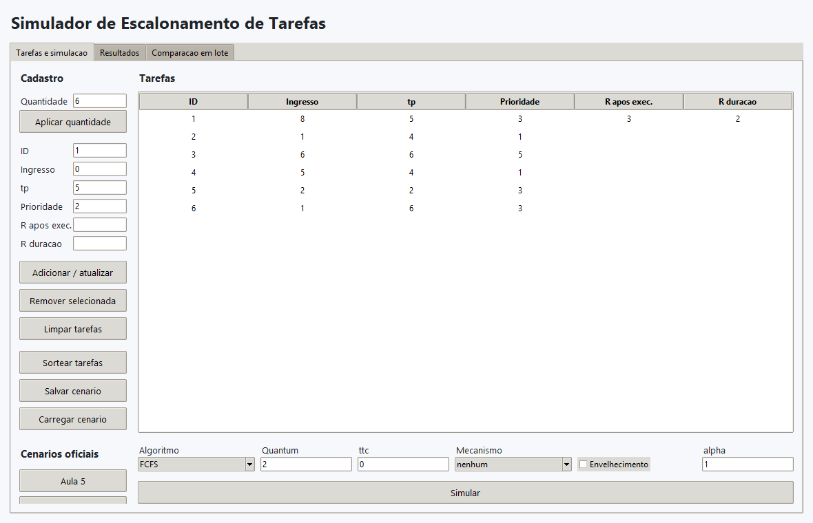
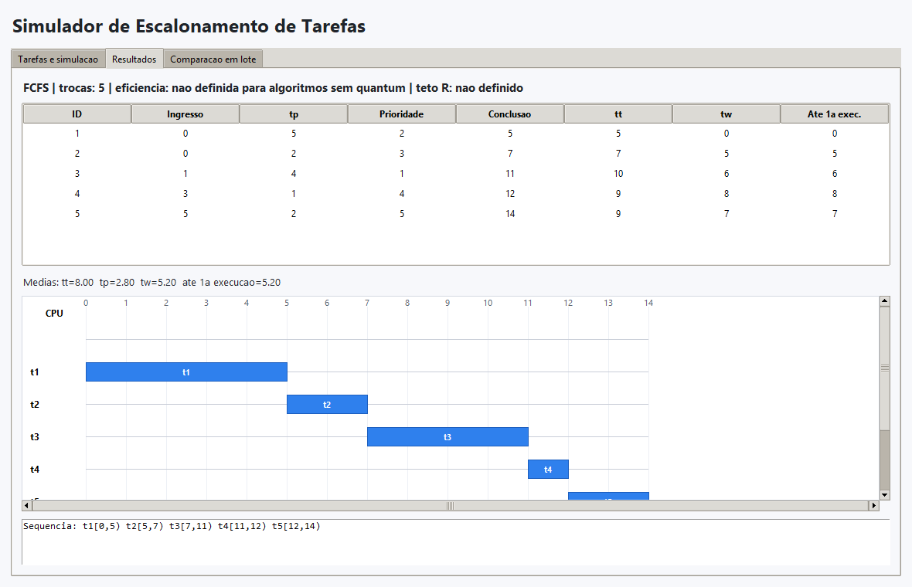
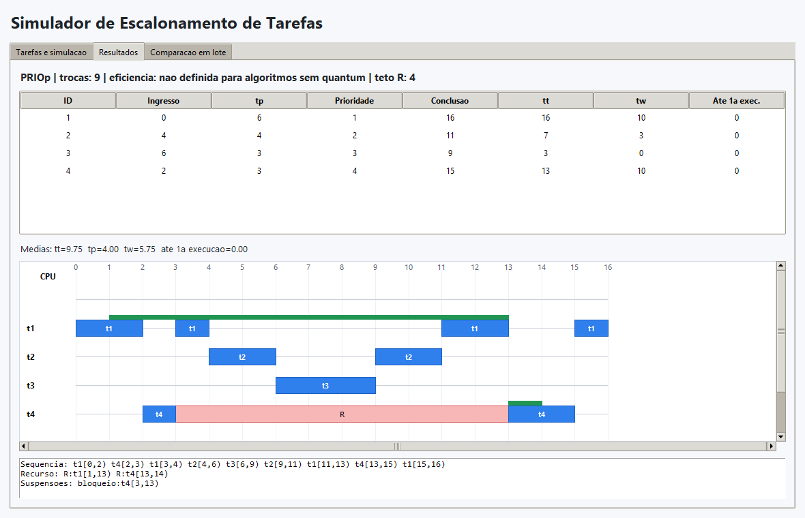
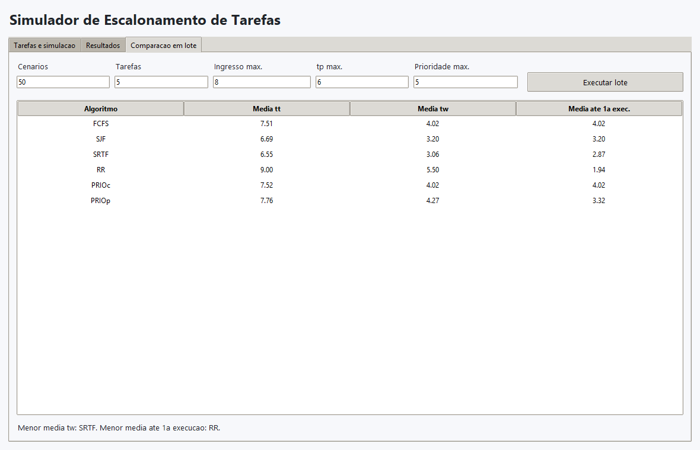

# Tutorial de Uso

## Definir quantidade de tarefas

1. Abra a aba `Tarefas e simulacao`.
2. No campo `Quantidade`, informe o numero de tarefas.
3. Clique em `Aplicar quantidade`.
4. A tabela passa a conter uma linha para cada tarefa, com valores iniciais.

## Cadastrar ou editar tarefas

1. Clique em uma linha da tabela.
2. Edite os campos `ID`, `Ingresso`, `tp` e `Prioridade`.
3. Para declarar uso do recurso R, preencha `R apos exec.` e `R duracao`.
4. Clique em `Adicionar / atualizar`.

Use `R apos exec.` para indicar depois de quantas unidades de execucao propria a tarefa obtem R. Use `R duracao` para indicar por quantas unidades de processamento ela mantem R.

Exemplo: `R apos exec. = 1` e `R duracao = 4` representa a secao critica `[1,5)`.

## Sortear tarefas

1. Informe a quantidade desejada.
2. Clique em `Sortear tarefas`.
3. Confira os valores sorteados na tabela.

O sorteio pode incluir secoes criticas em algumas tarefas.

## Configurar quantum e troca de contexto

1. Informe `Quantum`.
2. Informe `ttc`.
3. Para Round-Robin, garanta que `Quantum > ttc`.

Se `Quantum <= ttc`, o programa recusa a simulacao com mensagem clara.

## Selecionar algoritmo

No campo `Algoritmo`, escolha uma das opcoes:

| Opcao | Significado |
|---|---|
| `FCFS` | First-Come, First-Served |
| `SJF` | Shortest Job First |
| `SRTF` | Shortest Remaining Time First |
| `RR` | Round-Robin |
| `PRIOc` | Prioridade cooperativa |
| `PRIOp` | Prioridade preemptiva |

## Heranca, teto e sem mecanismo

No campo `Mecanismo`, escolha:

| Opcao | Uso |
|---|---|
| `nenhum` | Nao corrige inversao de prioridade. |
| `heranca` | Eleva temporariamente a prioridade do detentor de R quando ha tarefa bloqueada. |
| `teto` | Eleva o detentor de R ao teto assim que o recurso e obtido. |

Heranca e teto nao sao usados ao mesmo tempo.

## Envelhecimento

1. Marque `Envelhecimento`.
2. Informe `alpha`.
3. Execute com `PRIOc` para observar a reducao da inanicao no cenario oficial.

## Executar simulacao

1. Confira a tabela de tarefas.
2. Confira algoritmo, quantum, `ttc`, mecanismo e envelhecimento.
3. Clique em `Simular`.
4. Abra a aba `Resultados`.

## Interpretar metricas

A tabela de metricas apresenta, por tarefa:

| Coluna | Significado |
|---|---|
| `Conclusao` | Instante em que a tarefa termina. |
| `tt` | `conclusao - ingresso`. |
| `tp` | Tempo de processamento informado. |
| `tw` | `tt - tp`. |
| `Ate 1a exec.` | Tempo ate receber o processador pela primeira vez. |

As medias aparecem abaixo da tabela.

## Interpretar diagrama temporal

O diagrama mostra uma linha por tarefa e uma linha superior para CPU.

| Cor | Significado |
|---|---|
| Azul | Execucao da tarefa. |
| Amarelo | Troca de contexto. |
| Vermelho claro | Tarefa suspensa aguardando R. |
| Verde | Posse do recurso R. |
| Cinza | CPU ociosa. |

## Salvar cenario

1. Configure ou sorteie as tarefas.
2. Clique em `Salvar cenario`.
3. Escolha um arquivo `.json`.
4. Confirme o salvamento.

## Carregar cenario

1. Clique em `Carregar cenario`.
2. Escolha um arquivo `.json`.
3. Confira a tabela preenchida.
4. Execute a simulacao desejada.

## Conferir cenario conhecido

Use o botao `Aula 5` e execute os algoritmos com `ttc = 0`.

| Algoritmo | Media `tt` | Media `tw` | Media ate 1a exec. |
|---|---:|---:|---:|
| FCFS | 8,00 | 5,20 | 5,20 |
| RR, q=2 | 8,40 | 5,60 | 2,80 |
| SJF | 5,80 | 3,00 | 3,00 |
| SRTF | 5,40 | 2,60 | 2,40 |
| PRIOc | 6,60 | 3,80 | 3,80 |
| PRIOp | 5,60 | 2,80 | 2,20 |

Use o botao `Inversao` com `PRIOp`, `ttc = 0` e mecanismo `nenhum`.

| Tarefa | Conclusao | `tt` | `tw` |
|---|---:|---:|---:|
| t1 | 16 | 16 | 10 |
| t2 | 11 | 7 | 3 |
| t3 | 9 | 3 | 0 |
| t4 | 15 | 13 | 10 |

Depois altere o mecanismo para `heranca` e execute novamente. A tarefa `t4` deve concluir no instante 8 e seu bloqueio deve cair para `[3,6)`.

## Comparacao em lote

1. Abra a aba `Comparacao em lote`.
2. Informe quantidade de cenarios, quantidade de tarefas e limites de sorteio.
3. Confira `Quantum` e `ttc` na aba `Tarefas e simulacao`.
4. Clique em `Executar lote`.
5. Compare as medias de `tt`, `tw` e tempo ate a primeira execucao.

