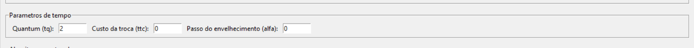
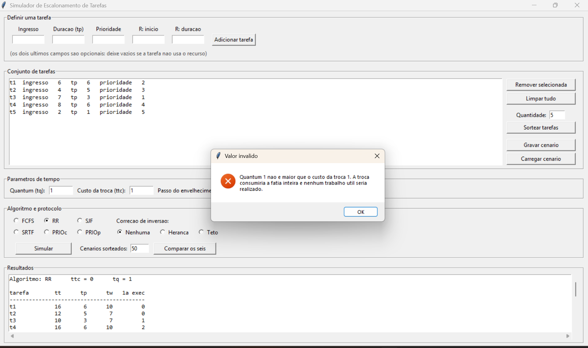
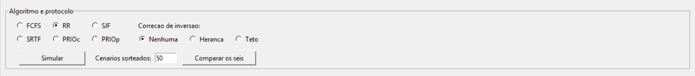
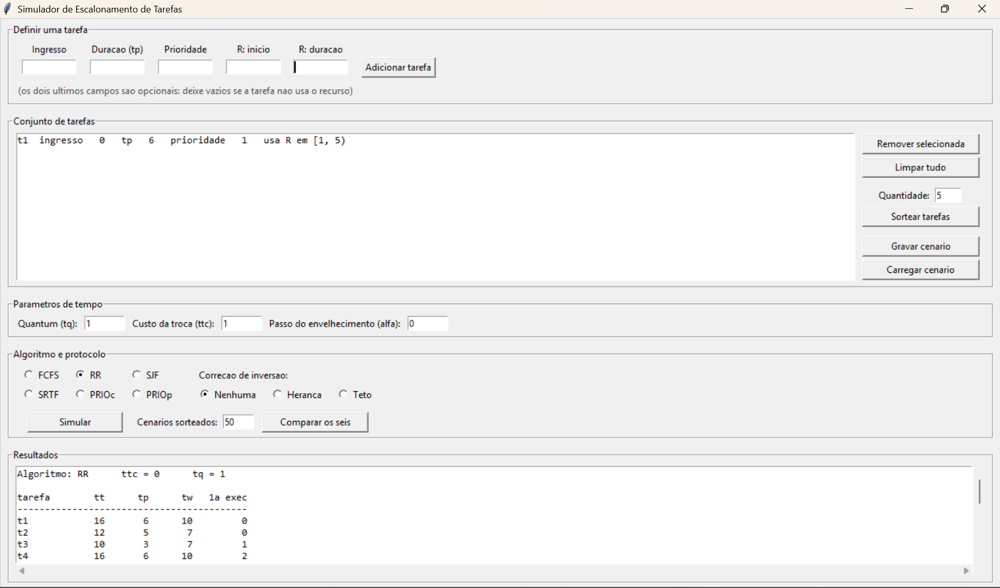
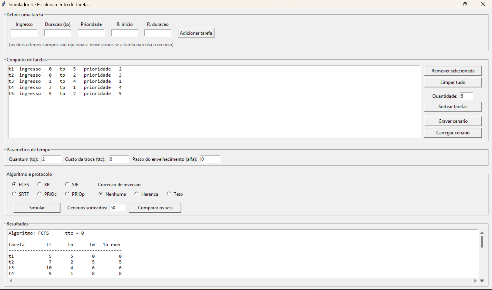
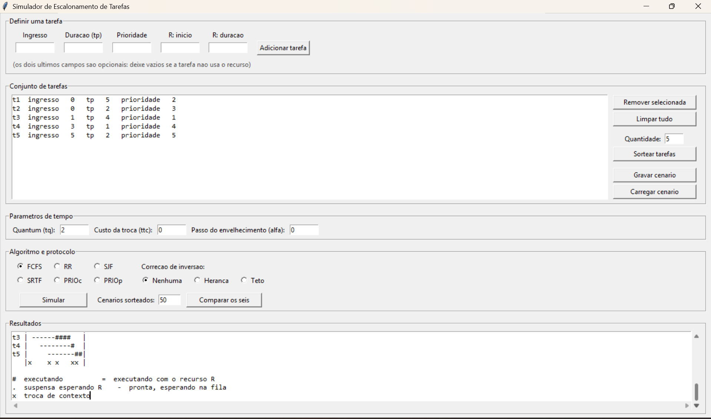
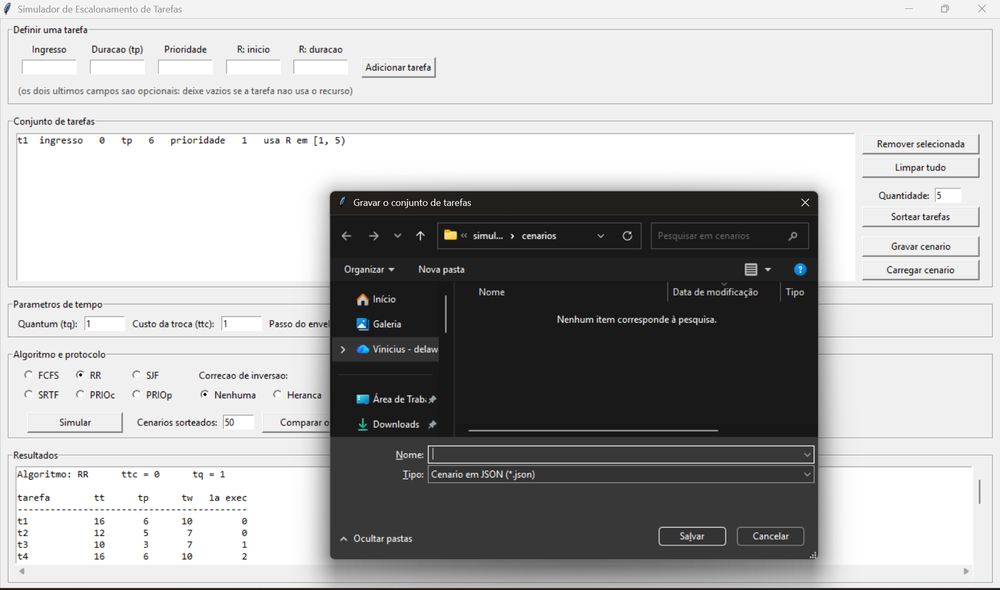
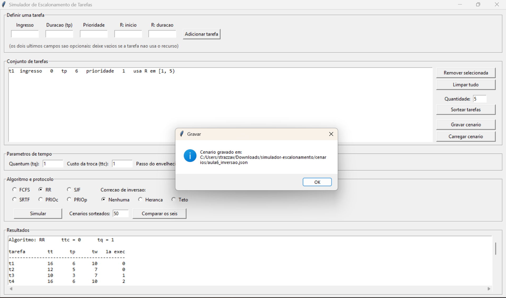

# Tutorial de Uso

## Simulador de Escalonamento de Tarefas

Disciplina de Sistemas Operacionais

Este tutorial percorre cada função do programa. Para abrir o simulador pela
primeira vez, consulte antes o
[tutorial de execução](./tutorial_execucao.pdf).

Ao final, a seção 8 traz um conjunto de tarefas de exemplo com os valores que o
simulador deve produzir, para você confirmar que o programa funciona
corretamente na sua máquina.

---

## 1. Definir o conjunto de tarefas

Uma tarefa é descrita por três valores obrigatórios: o instante de **ingresso**,
o tempo de processamento (**duração**) e a **prioridade**. Prioridade maior
significa prioridade mais alta.

Para cada tarefa:

1. Preencha **Ingresso**, **Duração (tp)** e **Prioridade** no bloco
   **Definir uma tarefa**;
2. Deixe **R: início** e **R: duração** vazios, salvo se a tarefa usar o
   recurso (seção 5);
3. Clique em **Adicionar tarefa**.

Os campos são limpos e a tarefa aparece na lista do bloco **Conjunto de
tarefas**, numerada como `t1`, `t2` e assim por diante.

Repita para cada tarefa. A ordem em que você as acrescenta define os
identificadores, e o identificador é usado como último critério de desempate
entre tarefas equivalentes.

### Corrigir um erro de digitação

Selecione a linha na lista e clique em **Remover selecionada**. As tarefas
restantes são renumeradas.

Se a tarefa errada não é a última, prefira **Limpar tudo** e digitar o conjunto
novamente. Ao remover, a tarefa reinserida entra no fim da lista e recebe o
último identificador, o que altera os desempates e pode mudar o resultado.

### Valores recusados

O programa recusa valores inválidos com uma mensagem, sem encerrar:

| Campo | Faixa aceita |
|---|---|
| Ingresso | inteiro maior ou igual a 0 |
| Duração | inteiro maior ou igual a 1 |
| Prioridade | inteiro maior ou igual a 1 |
| Seção crítica | início mais duração menor ou igual à duração da tarefa |

Texto que não seja um número inteiro, campo vazio e valores decimais também são
recusados.

---

## 2. Sortear tarefas

Em vez de digitar, você pode pedir um conjunto aleatório.

1. No bloco **Conjunto de tarefas**, informe a quantidade desejada no campo
   **Quantidade**;
2. Clique em **Sortear tarefas**.

A lista é **substituída** pelo conjunto sorteado.

O sorteio respeita as faixas válidas: ingresso de 0 a 8, duração de 1 a 6 e
prioridade de 1 a 5.

Cada sorteio produz um conjunto diferente. Para preservar um cenário
interessante, grave-o (seção 7).

---

## 3. Definir os parâmetros de tempo

O bloco **Parâmetros de tempo** tem três campos.

| Campo | O que é | Padrão |
|---|---|---|
| **Quantum (tq)** | O tamanho da fatia de tempo sob Round-Robin. Ignorado pelos outros cinco algoritmos. | 2 |
| **Custo da troca (ttc)** | O tempo consumido por cada troca de contexto. Vale para todos os algoritmos. | 0 |
| **Passo do envelhecimento (alfa)** | Quantas unidades de prioridade uma tarefa ganha por unidade de tempo de espera. Zero desativa o envelhecimento. | 0 |

Com o custo da troca em zero, a troca acontece mas não consome tempo, e os
resultados correspondem às tabelas estudadas em sala.

### Quantum menor ou igual ao custo da troca

Esta combinação é recusada. Selecione **RR**, informe quantum `1` e custo `1`, e
clique em **Simular**:

A razão é que o custo da troca é descontado da fatia concedida. Se a troca
consumisse a fatia inteira, nenhum trabalho útil seria realizado.

### Eficiência

A eficiência `E = tq / (tq + ttc)` aparece junto aos resultados. Com quantum 4 e
custo 1, ela vale 4/(4+1) = 0,800.

Nos cinco algoritmos sem quantum, o programa exibe "não definida" em vez de um
valor, porque a eficiência é propriedade da configuração do escalonador e não
existe sem quantum.

---

## 4. Escolher o algoritmo

O bloco **Algoritmo e protocolo** reúne as duas escolhas.

À esquerda, os seis algoritmos:

| Sigla | Algoritmo | Preempção | Critério de escolha |
|---|---|---|---|
| FCFS | First-Come, First-Served | não | menor instante de ingresso |
| RR | Round-Robin | sim, por quantum | primeiro da fila circular |
| SJF | Shortest Job First | não | menor tempo de processamento |
| SRTF | Shortest Remaining Time First | sim | menor tempo restante |
| PRIOc | Prioridade cooperativa | não | maior prioridade |
| PRIOp | Prioridade preemptiva | sim | maior prioridade |

À direita, a **correção de inversão de prioridades**, com três opções
mutuamente exclusivas:

| Opção | Efeito |
|---|---|
| **Nenhuma** | Nenhum protocolo de correção. A inversão de prioridades ocorre livremente. |
| **Herança** | A tarefa que detém o recurso assume a maior prioridade entre as tarefas suspensas à espera dele, e a devolve ao liberar. Age depois que a disputa aparece. |
| **Teto** | A tarefa que obtém o recurso assume imediatamente a maior prioridade entre as que podem usá-lo, sem esperar que um conflito ocorra. |

A correção só produz efeito quando há tarefas disputando o recurso. Herança e
teto são protocolos alternativos e não se combinam.

O **envelhecimento** não fica neste bloco: é habilitado informando um valor
maior que zero no campo **Passo do envelhecimento (alfa)**, no bloco de
parâmetros.

Depois de escolher, clique em **Simular**.

---

## 5. Declarar o uso do recurso

Uma tarefa pode declarar uma seção crítica: o trecho da sua execução em que
detém, com exclusão mútua, o recurso R. Enquanto ela o detém, nenhuma outra
tarefa consegue obtê-lo, por mais alta que seja a prioridade.

Os dois campos são medidos no **tempo de execução própria da tarefa**, não no
relógio:

- **R: início** — depois de quantas unidades de trabalho a tarefa obtém o
  recurso;
- **R: duração** — por quantas unidades ela o mantém.

Por exemplo, uma tarefa de duração 6 com início `1` e duração `4` obtém o
recurso depois de executar 1 unidade e o mantém até ter executado 5.

A lista mostra o intervalo como `usa R em [1, 5)`, indicando que o recurso é
detido da primeira à quinta unidade executada.

Se a tarefa for preemptada no meio da seção crítica, a conta não muda: o que
conta é quanto ela já trabalhou, não o instante do relógio.

A seção crítica precisa caber na duração da tarefa. Início 3 e duração 4 em uma
tarefa de duração 5 é recusado com mensagem.

---

## 6. Ler os resultados

O bloco **Resultados** apresenta duas coisas, uma abaixo da outra. Use as
barras de rolagem para percorrê-las.

### A tabela de métricas

Uma linha por tarefa, mais a linha de médias:

| Coluna | O que é |
|---|---|
| **tt** | Tempo de execução: da entrada da tarefa até a sua conclusão. |
| **tp** | Tempo de processamento demandado. É o dado de entrada, repetido para comparação. |
| **tw** | Tempo de espera: `tt - tp`. Engloba o tempo na fila, o tempo suspensa esperando o recurso e o tempo consumido por trocas de contexto. |
| **1a exec** | Tempo até a tarefa receber o processador pela primeira vez. |

Abaixo da tabela, o número total de trocas de contexto e a eficiência.

### O diagrama de tempo

Uma linha por tarefa, com o tempo no eixo horizontal. Cada caractere
corresponde a uma unidade de tempo:

| Símbolo | Significado |
|---|---|
| `#` | a tarefa está executando |
| `=` | a tarefa está executando e detém o recurso R |
| `.` | a tarefa está suspensa, esperando o recurso |
| `-` | a tarefa está pronta, esperando na fila |
| espaço | a tarefa ainda não ingressou, ou já concluiu |

A última linha, sem rótulo de tarefa, marca com `x` as unidades de tempo
consumidas por trocas de contexto. Com o custo da troca em zero, ela aparece
vazia: a troca ocorre, mas não consome tempo.

A distinção entre `-` e `.` é a informação que a tabela não dá. As duas
situações entram na mesma métrica `tw`, mas são fenômenos diferentes: `-` é
esperar a vez, e `.` é estar impedida de concorrer por causa do recurso.

---

## 7. Gravar e recarregar um cenário

Um conjunto de tarefas pode ser preservado para exame posterior. Isso importa
especialmente com cenários sorteados, que de outro modo desaparecem ao fim da
execução.

### Gravar

1. Com o conjunto montado, clique em **Gravar cenário**;
2. A janela de diálogo abre já na pasta `cenarios/` do projeto;
3. Informe um nome e clique em **Salvar**.

O arquivo é gravado em formato JSON, e guarda também o quantum, o custo da
troca e o passo do envelhecimento em uso no momento.

Uma mensagem confirma a gravação e informa o caminho completo do arquivo.

### Recarregar

1. Clique em **Carregar cenário**;
2. Selecione o arquivo e clique em **Abrir**.

A lista é substituída pelo conjunto gravado, e os três campos de parâmetros são
restaurados com os valores do arquivo.

Para confirmar que funcionou, grave um cenário, clique em **Limpar tudo**, e
carregue-o de volta. A lista deve voltar idêntica.

---

## 8. Conferir um resultado conhecido

Esta seção permite confirmar que o programa produz os valores corretos na sua
máquina.

Clique em **Limpar tudo** e defina estas cinco tarefas, nesta ordem, com os
campos de R vazios:

| | Ingresso | Duração | Prioridade |
|---|---|---|---|
| t1 | 0 | 5 | 2 |
| t2 | 0 | 2 | 3 |
| t3 | 1 | 4 | 1 |
| t4 | 3 | 1 | 4 |
| t5 | 5 | 2 | 5 |

Parâmetros: **Quantum 2**, **Custo da troca 0**, **alfa 0**. Correção de
inversão em **Nenhuma**.

Selecione cada algoritmo e clique em **Simular**. A linha de médias deve
apresentar:

| Algoritmo | tt | tw | 1a exec | trocas |
|---|---|---|---|---|
| FCFS | 8,00 | 5,20 | 5,20 | 5 |
| RR | 8,40 | 5,60 | 2,80 | 8 |
| SJF | 5,80 | 3,00 | 3,00 | 5 |
| SRTF | 5,40 | 2,60 | 2,40 | 6 |
| PRIOc | 6,60 | 3,80 | 3,80 | 5 |
| PRIOp | 5,60 | 2,80 | 2,20 | 7 |

Em seguida, mude o **Quantum para 4** e o **Custo da troca para 1**, e rode
apenas FCFS e RR:

| Algoritmo | tt | tw | Eficiência |
|---|---|---|---|
| FCFS | 11,00 | 8,20 | não definida |
| RR | 13,40 | 10,60 | 0,800 |

Se esses valores conferem, o simulador está correto.

---

## 9. Comparar os seis algoritmos sobre um lote

Os valores da seção anterior são de um cenário específico. Para verificar se as
conclusões valem em geral, o programa compara os seis algoritmos sobre um lote
de cenários sorteados.

1. Informe a quantidade de tarefas por cenário no campo **Quantidade**, no
   bloco Conjunto de tarefas;
2. Informe o tamanho do lote no campo **Cenários sorteados**, ao lado do botão
   Simular;
3. Clique em **Comparar os seis**.

O cálculo leva alguns segundos. O resultado é uma tabela com as médias de cada
algoritmo, seguida da indicação de qual apresenta o menor tempo de espera e
qual apresenta o menor tempo até a primeira execução.

Clique novamente. Os valores absolutos mudam, porque cada lote sorteia outros
cenários. O que se mantém, com algumas dezenas de amostras, é a ordenação: o
**SRTF** apresenta o menor tempo de espera médio e o **Round-Robin** o menor
tempo até a primeira execução.

É essa estabilidade que mostra que as conclusões não são propriedade de um
cenário particular.
